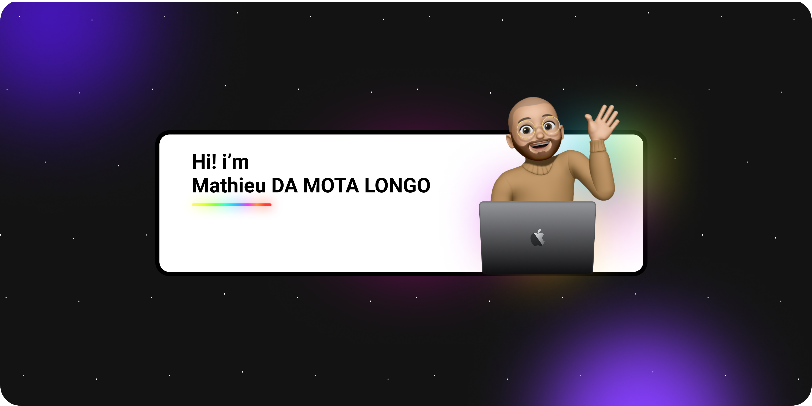

  

<h3 align="center"><b><a href="https://mathieudamotalongo.me/">🏠 Portfolio</a></b> • <b><a href="https://www.behance.net/Mathieu_DML">📰 Behance</a></b> • <b><a href="https://www.linkedin.com/in/mathieu-da-mota-longo/">👔 LinkedIn</a></b></h3>

### About me

* 🙌🏻 Hello, web player strip from all walks of life!

* My name is Mathieu DA MOTA LONGO - the Chief Happiness Dealer ☀️. Currently in BTS SIO option SLAM at the Esiee-IT school and in the process of bringing out the raclette machine 🧀. A young person in search of the most greedy challenge 🚀, whether in development or network.

* I'll let you go explore the different projects available on Github. Beautiful day !

### It's me

* 🎓 preparation of 2 years of **IT training**, bts diploma in IT services to organizations in software solutions and business applications.
* 🏢 Young bachelor in STI2D **science and technology of industry and sustainable development**.
* 🖥 Currently in an IT and telecom service company, I work as an IT and telecom technician.
* 💻 I love everything **web design and development**
* 🚀 Thanks to my work-study program in my company, I acquired **network skills**

### I like to work with

* 🌐 Python, Django, JavaScript, Html, css
* 🕹️ Cinema 4D, Blender, Solidworks
* 🎨 Creative cloud

### What I'm doing recently

* 📚 Study **programming language** in python, javascript, and html etc ...
* 🕹️ Consolidate **development skills** to refine my <a href="https://mathieudamotalongo.me/">🏠 Portfolio</a>
* 🌐 Carry out personal projects for the **creation of an application** under ios

### My passions

* 🎵 Music
* 📷 Photography
* 👨🏻‍💻 technology
* 🎨 Design
* 🎞️ Movies
